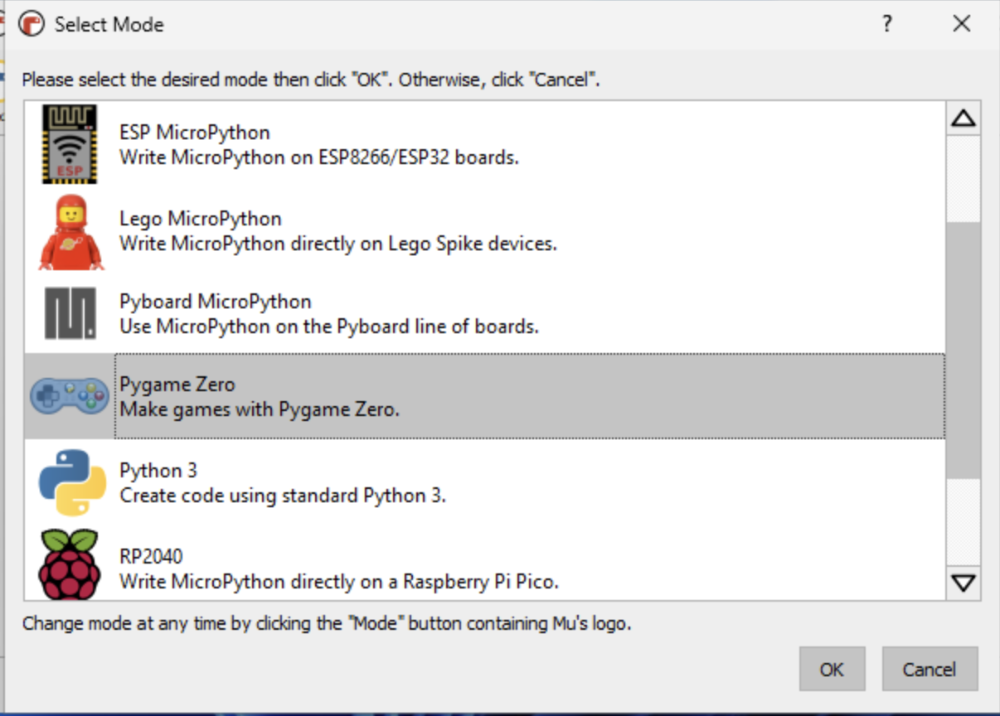

# Installation af MU Editor

MU Editor er et intergretet udviklings miljø, som giver en nem introduktion til at udvikle i Python.

Der er andre muligheder som Microsoft VS Code eller pyCharm, men de kræver lidt mere vide og arbejde for at få dem op at køre.

Download fra: https://codewith.mu/en/download

### Installere MU Editor

- Windows: MuEditor-win64.msi 
Installations [instruktioner](https://codewith.mu/en/howto/1.2/install_windows)

- Linux: MuEditor-Linux-1.2.0-x86_64.tar 
Installations [Instruktioner](https://codewith.mu/en/howto/1.2/install_linux)

- MacOS: MuEditor-OSX-1.2.0.dmg 
Installation [Instruktioner](https://codewith.mu/en/howto/1.2/install_macos)

### Efter installationen

- Start MU Editor (se installation instruktionerne for dit valgte OS)
- vent, vent, vent .... vent....

- Vælg 'Pygame Zero'

- Følg [vejledningen](https://codewith.mu/en/tutorials/1.2/pgzero) til at lave et simpelt pyGame Zero spil.
