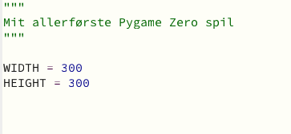
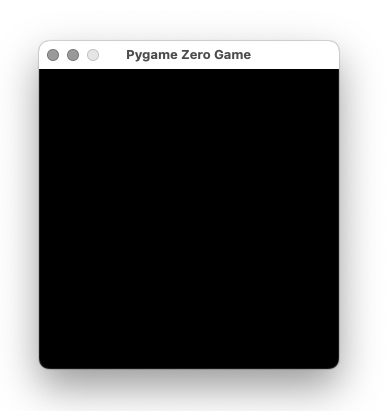
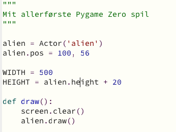
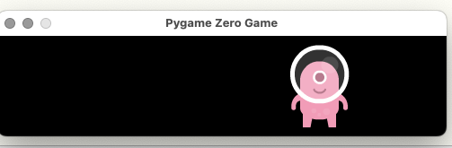

# My first game

Simple version af (Pygame Zero Introduction)[https://pygame-zero.readthedocs.io/en/stable/introduction.html]

1. Start MU (mere [her](https://github.com/casperghst42/codingpirates/tree/main/mu-editor))
2. Click [+] New for at lave en ny fil
3. Indsæt følgende:
```py
"""
Mit allerførste Pygame Zero spil
"""

WIDTH = 300
HEIGHT = 300
```




4. Tryk på [Save] for at gemme.<br/>
4.1. Opret en folder (direktory): codingpirates/first-game<br/>
4.2. Gem filen: first-game.py<br/>
5. Kør filen ved at trykke på [Run], og du skulle gerne se:<br/>

6. Download følgende filer:<br/>
- [eep.wav](https://pygame-zero.readthedocs.io/en/stable/_static/eep.wav)
- [Platformer Art Deluxe](https://www.kenney.nl/assets/sci-fi-sounds)<br/><br/>
6.1. Unzip filerne Platform Art Delux<br/>
6.2. I dit codingpirates/first-game opret følgende directories:<br/>
6.2.1. sounds<br/>
6.2.2. images<br/>
6.2. Fra "Platform Art Deleux" kopire "Extra animations and enemies/Alien sprites/alienGreen.png" til dit images directory og omdøb den til alien.png.<br/>
6.2. Fra "Platform Art Deleux" kopire "Extra animations and enemies/Alien sprites/alienGreen_hurt.png" til dit images directory og omdøb den til alien_hurt.png.<br/>
6.3. Og kopiere eep.wav til dit sounds directory."<br/>

6. Tilføj følgende:
```py
alien = Actor('alien')
alien.pos = 100, 56

WIDTH = 500
HEIGHT = alien.height + 20

def draw():
    screen.clear()
    alien.draw()
```


7. Test ....<br/>


8. Tilføj følgende:
8.1 Efter "alien.pos...":
```py
alien.topright = 0, 10
```
8.2 Efter "draw()" funktionen, tilføj følgende funktion:
```py
def update():
    alien.left += 2
    if alien.left > WIDTH:
        alien.right = 0
```
Der skulle nu være lidt bevægelse!!! (ya!)

Hvad med at kunnen klikke på noget.

9. Efter "update()" funktionen, tilføj dette:
```py
def on_mouse_down(pos):
    if alien.collidepoint(pos):
        print("Eek!")
    else:
        print("You missed me!")
```
<strong>Prøv at klikke på vores alien.</strong> Og kig på status vinduet:

```
Eek!
Eek!
You missed me!
You missed me!
```
)

10. Sikre dig at du har følgende filer (da )

11. Ændre vores on_mouse_down(pos) til dette:
```py
def on_mouse_down(pos):
    if alien.collidepoint(pos):
        alien.image = 'alien_hurt'
```

Nu kan vi da se at vi rammer vores alien. 

12. Tilføj følgende line i on_mouse_down(pos):
```py
sounds.eep.play()
```
Husk indryk (indent) og at det kun skal udføres hvis man rammen figuren.
```py
def on_mouse_down(pos):
    if alien.collidepoint(pos):
        sounds.eep.play()
        alien.image = 'alien_hurt'
```

13. Tilføj følgende i toppen af din fil:
```py
import time
```

Ellers får du en fejl med den næste ændring.

14. Ændre on_mouse_down(pos) til:
```py
def on_mouse_down(pos):
    if alien.collidepoint(pos):
        sounds.eep.play()
        alien.image = 'alien_hurt'
        time.sleep(1)
        alien.image = 'alien'
```

Men der sker jo ikke noget .... 


15. Ændre on_mounse_down(pos) til:
```py
def on_mouse_down(pos):
    if alien.collidepoint(pos):
        set_alien_hurt()
```

16. Tilføj følgende:
```py

def set_alien_hurt():
    alien.image = 'alien_hurt'
    sounds.eep.play()


def set_alien_normal():
    alien.image = 'alien'

```

Og du kan fjerne dette:
```
import time
```

Se det virker, men vores alien bliver jo ved med at se lidt sjov ud.

17. Tilføj følgende:
Dette sætter en "scheduler" op som efter et stykke tid kalder 'set_alien_normal()'
```py
def set_alien_hurt():
    alien.image = 'alien_hurt'
    sounds.eep.play()
    clock.schedule_unique(set_alien_normal, 1.0)
```


Koden med mere fyldige forklaring ligger her: [Pygame Zero Introduction](https://pygame-zero.readthedocs.io/en/stable/introduction.html)

